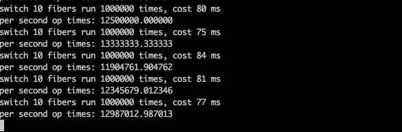

# CxxFiber

## C++协程库.
<br/>
*英文版本: [English](README.md)*

### 目录
- [特点](#特点)
- [示例](#示例)
- [性能](#性能)
- [依赖](#依赖)
- [TODO](#todo)
- [Support](#support)

#### 特点
* 跨平台：同时支持Linux32/64、OSX64两个平台，支持C++98；
* 高性能：网络性能强劲，支持海量协程，从此单机1000K不再是问题；
* 易开发：同步的方式编写代码，API优雅简洁、简单易用、开发高效；
* 强融合：支持进程、线程、协程的混合使用，各司其职，充分发挥各自优点；

#### 示例
  `c++:`

  ```
  #include "Eco.hh"
  
  int main(int argc, const char **argv) {
    // CxxJDK init.
    ESystem::init(argc, argv);
        
    try {
		EFiberScheduler scheduler;
		
		scheduler.schedule([&](){
			EServerSocket ss;
			ss.setReuseAddress(true);
			ss.bind(8888);

			while (!gStopFlag) {
				// accept
				sp<ESocket> socket = ss.accept();
				if (socket != null) {
					// 创建新的协程
					scheduler.schedule([=](){
						try {
							char buf[512] = {0};
							// read
							EInputStream* is = socket->getInputStream();
							int n = is->read(buf, sizeof(buf));
							printf("read buf=%s\n", buf);

							// write
							EOutputStream* os = socket->getOutputStream();
							os->write(buf, n);
						} catch (EIOException& e) {
							e.printStackTrace();
						} catch (...) {
						}
					});
				}
			}
		});

		// 开始协程调度
		scheduler.join(); //单线程调度模式
		//scheduler.join(4); //多线程调度模式：参数4表示并发调度的线程数
	}
	catch (EException& e) {
		e.printStackTrace();
	}
	catch (...) {
		printf("catch all...\n");
	}
    
    ESystem::exit(0);
    
    return 0;
  }
  
  ```

更多示例：  
[testeco.cpp](test/testeco.cpp)  

#### 性能
`软件环境:`

见示例c++代码：[benchmark.cpp](test/benchmark.cpp)；


`硬件环境：`

```
型号名称：	MacBook Pro
型号标识符：	MacBookPro10,2
处理器名称：	Intel Core i5
处理器速度：	2.6 GHz
处理器数目：	1
核总数：	2
```
`测试结果：`



#### 依赖
`CxxFiber`基于[CxxJDK](https://github.com/cxxjava/cxxjdk)开发.  

#### TODO
    支持Win64平台。

#### Support
Email: [cxxjava@163.com](mailto:cxxjava@163.com)